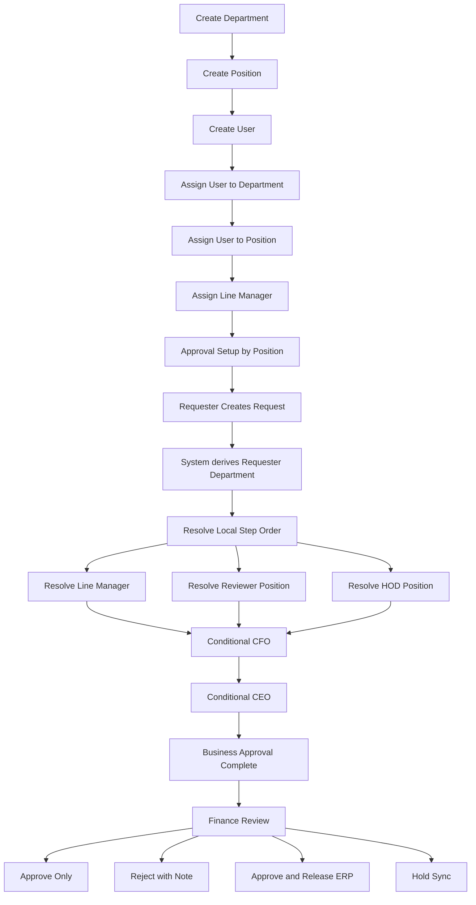

# Setup Flow Guide

This guide explains the new master-data-first flow:

1. create `Department`
2. create `Position`
3. create `User`
4. assign `Department + Position + Line Manager` to user
5. map approval roles by `Position`
6. submit request without choosing department manually

## Why This Model

The requester should not choose department on the request form. Department comes from the logged-in user profile.

Approval setup should also avoid hard-binding workflow to one person whenever possible. Instead:

- `Line Manager` comes from user profile
- `Reviewer` comes from department + position mapping
- `HOD` comes from department + position mapping
- `CFO` and `CEO` come from global positions

## High-Level Flow



## Controlled Workflow Order

The system allows controlled reordering only for local department steps:

- `line_manager`
- `reviewer`
- `hod`

`cfo` and `ceo` stay at the end because they are final conditional approvals.

Examples:

- `line_manager -> reviewer -> hod`
- `reviewer -> line_manager -> hod`
- `reviewer -> hod -> line_manager`

Not allowed:

- adding custom steps
- removing `cfo/ceo` semantics from policy
- drag-drop free-form workflow builder

## Screen-by-Screen Setup

### 1. Master Data

Use `Master Data` first.

Create or update users with:

- `Department`
- `Position`
- `Role`
- `Line Manager`
- `Active`

Recommended starter setup:

- requester user:
  - department: `dep-a`
  - position: `staff`
  - line manager: `approver1`
- line manager:
  - department: `dep-a`
  - position: `line_manager`
- reviewer:
  - department: `dep-a`
  - position: `reviewer`
- hod:
  - department: `dep-a`
  - position: `hod`
- cfo:
  - department: `dep-finance`
  - position: `cfo`
- ceo:
  - department: `dep-finance`
  - position: `ceo`

### 2. Approval Setup

Then open `Approval Setup`.

For each department:

- select `Reviewer Position`
- select `HOD Position`
- optionally select `Fallback Position`
- reorder local steps if needed

For global config:

- select `CFO Position`
- select `CEO Position`
- set `CFO Threshold`
- set `CEO Threshold`

Important:

- requester department comes from user profile
- line manager comes from user profile
- approval setup maps roles to positions, not to individual users

## Expected Runtime Behavior

When requester submits:

1. system reads requester profile
2. system derives requester department
3. system resolves local step order from department setup
4. system resolves:
   - line manager from user profile
   - reviewer from department + reviewer position
   - hod from department + hod position
5. system conditionally appends:
   - cfo by global position + threshold
   - ceo by global position + threshold
6. system deduplicates repeated approvers and keeps the highest-priority step

Priority:

- `ceo`
- `cfo`
- `hod`
- `reviewer`
- `line_manager`

## End-to-End Test Guide

### Scenario A: below CFO threshold

Setup:

- requester in `dep-a`
- line manager = `approver1`
- `dep-a reviewer position = reviewer`
- `dep-a hod position = hod`
- global `cfo threshold = 500000`
- global `ceo threshold = 1000000`

Test:

1. create request amount `400000`
2. submit
3. expected chain:
   - `line_manager`
   - `reviewer`
   - `hod`

### Scenario B: above CFO threshold

Test:

1. create request amount `700000`
2. submit
3. expected chain:
   - local steps in configured order
   - `cfo`

### Scenario C: above CEO threshold

Test:

1. create request amount `1500000`
2. submit
3. expected chain:
   - local steps in configured order
   - `cfo`
   - `ceo`

### Scenario D: change local order by department

Setup:

- for `dep-b`, set step order to `reviewer -> line_manager -> hod`

Test:

1. create request by a user in `dep-b`
2. submit
3. expected chain starts with `reviewer`

### Scenario E: finance review after business approval

After final business approval:

1. request moves to finance queue
2. finance opens detail to inspect request
3. finance can:
   - `Approve Only`
   - `Reject` with mandatory note
   - `Approve & Release ERP`
   - `Hold Sync`

## Local Runtime Patch

If your Docker PostgreSQL volume was created before the positions refactor, apply:

```powershell
Get-Content db/manual/2026-03-26_positions_refactor.sql | docker compose exec -T postgres psql -U payment_app -d payment_request
```

If auditor seed is also missing, apply:

```powershell
Get-Content db/manual/2026-03-26_seed_auditor.sql | docker compose exec -T postgres psql -U payment_app -d payment_request
```
